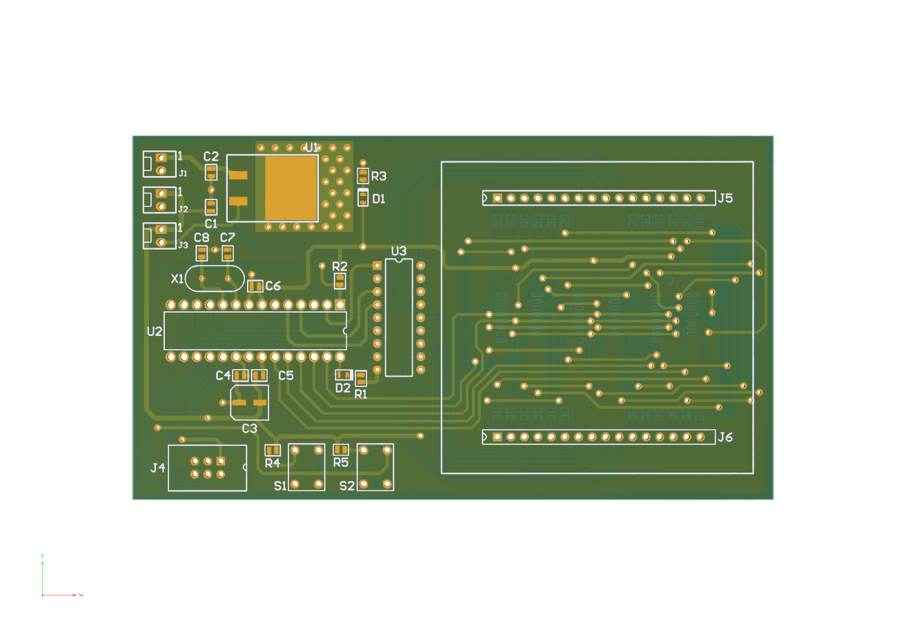

# RGB-Matrix-PCB
ATmega328P-based RGB LED matrix driver inspired by Cal Poly’s iDesign project. Designed a 2-layer PCB using Altium with shift registers and Darlington transistor array for full RGB control.

## Project Details

**Project Name:** RGB Matrix PCB

**Software Used:** Altium

This project is inspired by the [RGB LED Matrix Controller from Cal Poly iDesign](https://idesign.calpoly.edu/student-projects/rgb-led-matrix-controller)

## ⚙System Architecture

### ATmega328P
- Central controller for display logic  
- Communicates with shift registers via SPI  

### SN74HC595N (x3)
- 8-bit serial-in, parallel-out shift registers  
- Used to control the Red, Green, and Blue channels of each column  

### ULN2803A
- 8-channel Darlington transistor array  
- Drives the common cathodes (rows) of the LED matrix  
- Boosts current from logic-level to suitable drive levels for LEDs  

### Power Supply
- 6x AA batteries (~9V)  
- Regulated to 5V using 7805 voltage regulator

## Project Files
- `Altium files` -- Altium files
- `Assembly Files` -- Assembly files
- `Bill of Materials` -- Bill of Material
- `Gerber Files` -- Gerber Files
- `Images` -- Images
- `NC Drill Files` -- NC Drill

  

## Images

### Schematic

### PCB Layout

### 3D

